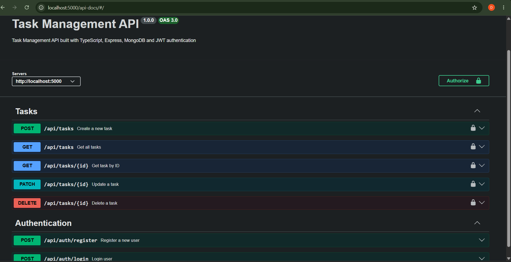
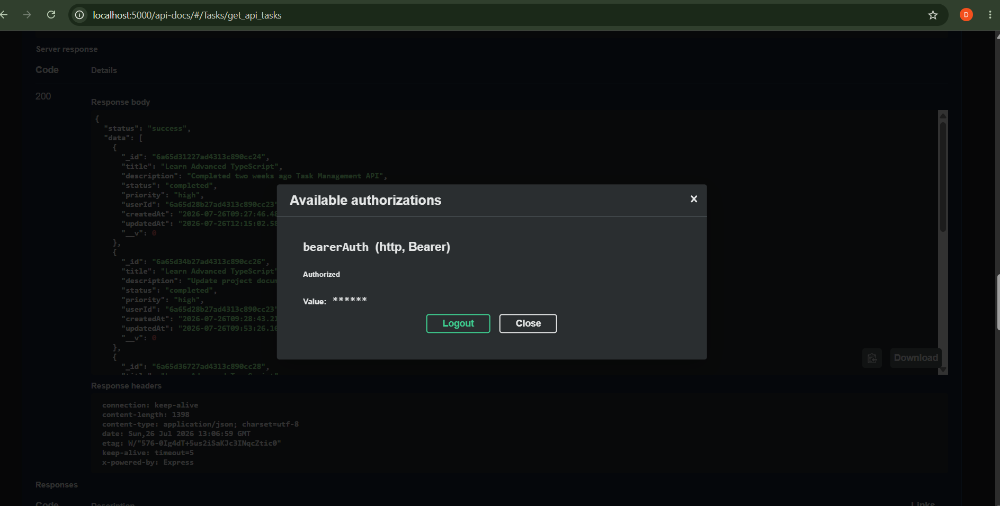

# Task Management System


A production-ready Task Management API built with **TypeScript, Express.js, MongoDB, JWT Authentication, Swagger, Jest, Supertest, Docker, and GitHub Actions** following a scalable layered backend architecture.

---

# Overview

Task Management System is a backend application designed to manage user tasks securely and efficiently.

The project follows professional backend development practices including:

- Layered Architecture
- Repository Pattern
- Service Layer Pattern
- JWT Authentication
- Request Validation
- Centralized Error Handling
- API Documentation with Swagger
- Automated API Testing
- Docker Containerization
- CI/CD with GitHub Actions

The goal of this project is to demonstrate a scalable and maintainable backend structure suitable for real-world applications.

---

# Features

## Authentication

- User registration
- User login
- JWT-based authentication
- Secure password hashing with bcrypt

---

## Task Management

- Create tasks
- Get authenticated user's tasks
- Get task by ID
- Update tasks
- Delete tasks
- Task ownership management
- Task status management
- Task priority management

---

## Backend Features

- TypeScript implementation
- Express.js REST API
- MongoDB database integration
- Mongoose ODM
- Repository Pattern
- Service Layer Architecture
- Joi request validation
- Centralized error handling
- Authentication middleware

---

## Documentation & Testing

- Swagger API Documentation
- Jest testing framework
- Supertest API testing
- MongoDB Memory Server for isolated tests

---

# Tech Stack

## Backend

- Node.js
- Express.js
- TypeScript

## Database

- MongoDB
- Mongoose

## Authentication & Security

- JSON Web Token (JWT)
- bcryptjs
- Authentication Middleware

## Validation

- Joi

## Testing

- Jest
- Supertest
- MongoDB Memory Server

## Documentation

- Swagger UI
- swagger-jsdoc

## DevOps

- Docker
- Docker Compose
- GitHub Actions

---

# Swagger API Documentation

Interactive API documentation is available through Swagger UI.

Swagger allows you to:

- View all available endpoints
- Test API requests
- Send JWT authentication tokens
- Explore request and response schemas





---

# Architecture

The project follows a layered backend architecture:

```text
Request
   │
   ▼
Route
   │
   ▼
Controller
   │
   ▼
Service
   │
   ▼
Repository
   │
   ▼
Model
   │
   ▼
MongoDB
```

This architecture provides:

- Better separation of concerns
- Easier maintenance
- Improved scalability
- Better testability

---

# Project Structure

```text
task-management-system-TS
│
├── docs
│
└── server
    │
    ├── src
    │   ├── controllers
    │   ├── services
    │   ├── repositories
    │   ├── models
    │   ├── routes
    │   ├── middleware
    │   ├── validators
    │   ├── interfaces
    │   └── server.ts
    │
    ├── tests
    │
    ├── Dockerfile
    ├── docker-compose.yml
    ├── package.json
    ├── package-lock.json
    └── tsconfig.json
```

---

# Installation

## Clone the repository

```bash
git clone https://github.com/DaryaMarco/task-management-system-TS.git
```

## Navigate into the backend folder

```bash
cd server
```

## Install dependencies

```bash
npm install
```

---

# Environment Variables

Create a `.env` file inside the `server` directory:

```env
PORT=5000

MONGO_URI=mongodb://mongodb:27017/task-management

JWT_SECRET=your_secret_key
```

---

# Running the Project

## Development Mode

```bash
npm run dev
```

Server runs on:

```text
http://localhost:5000
```

---

# Docker Setup

The project includes Docker support using Docker Compose.

Docker Compose starts:

- Node.js API container
- MongoDB database container
- Internal Docker network
- MongoDB healthcheck
- API healthcheck

## Build and Run Containers

From the `server` directory:

```bash
docker compose up --build
```

After successful startup:

### API

```text
http://localhost:5000
```

### Health Check

```text
http://localhost:5000/health
```

Expected response:

```json
{
  "status": "OK",
  "message": "API is running",
  "timestamp": "2026-07-28T18:55:28.412Z"
}
```

## Stop Containers

```bash
docker compose down
```

## Remove Containers and Volumes

```bash
docker compose down -v
```

---

# Docker Architecture

```text
              Docker Network
                    │
                    │
      task-management-api
                    │
                    │
   task-management-mongodb
```

The API container communicates with MongoDB through Docker's internal networking:

```text
mongodb://mongodb:27017/task-management
```

Docker healthchecks ensure:

- MongoDB is ready before API startup
- API is responding correctly
- Failed containers restart automatically

---

# API Documentation

Swagger UI:

```text
http://localhost:5000/api-docs
```

---

# API Endpoints

## Authentication

| Method | Endpoint | Description | Authentication |
|--------|----------|-------------|----------------|
| POST | `/api/auth/register` | Register new user | Public |
| POST | `/api/auth/login` | Login user | Public |

### Tasks

| Method | Endpoint | Description | Authentication |
|--------|----------|-------------|----------------|
| POST | `/api/tasks` | Create task | Required |
| GET | `/api/tasks` | Get user's tasks | Required |
| GET | `/api/tasks/:id` | Get task by ID | Required |
| PATCH | `/api/tasks/:id` | Update task | Required |
| DELETE | `/api/tasks/:id` | Delete task | Required |

---

# Authentication Flow

Protected routes require JWT authentication.

```text
Client Request
      │
      ▼
Authentication Middleware
      │
      ▼
Controller
      │
      ▼
Service Layer
      │
      ▼
Repository Layer
      │
      ▼
MongoDB
```

---

# API Testing

The project includes automated tests using:

- Jest
- Supertest
- MongoDB Memory Server

Tests cover:

- User registration
- User login
- Task creation
- Task retrieval
- Task updating
- Task deletion

Run tests:

```bash
npm test
```

---

# Security Features

The application includes:

- Password hashing with bcrypt
- JWT authentication
- Protected API routes
- Request validation
- Centralized error handling
- Secure authentication workflow

---

# CI/CD

GitHub Actions workflow is used to automate:

- Installing dependencies
- Running TypeScript build
- Running automated tests

Pipeline:

```text
Push Code
    │
    ▼
GitHub Actions
    │
    ▼
npm install
    │
    ▼
npm run build
    │
    ▼
npm test
```

---

# Future Improvements

Planned improvements:

- Cloud deployment
- React frontend application
- Advanced authorization roles
- Pagination and filtering
- Task due dates and reminders
- Monitoring and logging improvements

---

# Author

Developed by **Darya**
````
